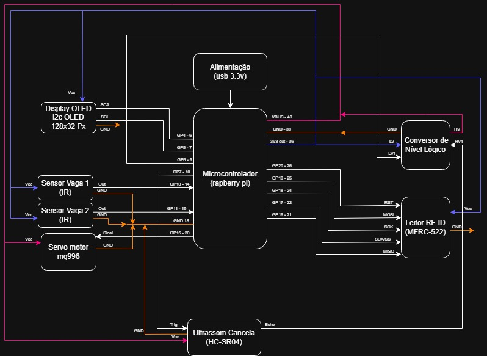

# 🅿️ Vaga Inteligente — Raspberry Pi Pico

Sistema embarcado de controle de acesso a um estacionamento com **2 vagas**, desenvolvido em **MicroPython** com Raspberry Pi Pico. O usuário se identifica por RFID, o sistema verifica a disponibilidade de vagas, indica qual vaga usar no display OLED e aciona a cancela via servo motor — fechando-a apenas quando não há carro na região de passagem.

---

## 📋 Sumário

- [Descrição do Problema](#-descrição-do-problema)
- [Funcionalidades](#-funcionalidades)
- [Hardware](#-hardware)
- [Diagrama de Blocos](#-diagrama-de-blocos)
- [Pinagem](#-pinagem)
- [Como Rodar](#-como-rodar)
- [Estrutura do Repositório](#-estrutura-do-repositório)
- [Documentação](#-documentação)
- [Equipe](#-equipe)

---

## 🧩 Descrição do Problema

Estacionamentos sem automação exigem funcionários para controle de acesso e não fornecem informação prévia sobre disponibilidade de vagas, causando filas e desperdício de tempo. Este projeto propõe uma solução embarcada de baixo custo para automatizar o controle de entrada, identificação do usuário e direcionamento para vagas disponíveis.

---

## ✅ Funcionalidades

- Leitura de cartão/tag RFID para identificação do usuário
- Verificação automática de vagas livres/ocupadas via sensores IR
- Indicação da vaga disponível no display OLED
- Abertura automática da cancela com servo motor
- Segurança: cancela não fecha enquanto houver carro na região de passagem (sensor HC-SR04)
- Mensagens de status no display:
  - `"Bem-vindo, [Nome]. Vaga: X"`
  - `"Estacionamento cheio"`
  - `"Cartão não cadastrado"`
  - `"Carro detectado. Aguarde..."`

---

## 🔧 Hardware

| Componente | Função |
|---|---|
| Raspberry Pi Pico | Microcontrolador principal (MicroPython) |
| Leitor RFID MFRC522 | Identificação do usuário por cartão/tag |
| Display OLED I2C SSD1306 (128×32) | Exibição de mensagens ao usuário |
| 2× Sensor de Obstáculo IR | Detecção de ocupação nas vagas |
| Sensor Ultrassônico HC-SR04 | Segurança da cancela |
| Conversor de Nível Lógico | Compatibilidade 5V→3,3V (ECHO do HC-SR04) |
| Servo Motor SG90 | Acionamento mecânico da cancela |
| Protoboard + Jumpers | Montagem do circuito |
| Alimentação USB 3,3V | Fonte de energia do sistema |

---

## 🗂️ Diagrama de Blocos



---

## 📌 Pinagem

### Display OLED SSD1306 (I2C)
| Pino OLED | Pino Pico |
|---|---|
| VCC | 3V3 |
| GND | GND |
| SCL | GP1 |
| SDA | GP0 |

### Leitor RFID MFRC522 (SPI)
| Pino MFRC522 | Pino Pico |
|---|---|
| SDA/SS | GP17 |
| SCK | GP18 |
| MOSI | GP19 |
| MISO | GP16 |
| RST | GP20 |
| 3.3V | 3V3 |
| GND | GND |

### HC-SR04 (Ultrassônico — Cancela)
| Pino HC-SR04 | Conexão |
|---|---|
| VCC | VBUS (5V) |
| GND | GND |
| TRIG | GP7 |
| ECHO | Conversor de nível → GP6 |

> ⚠️ O ECHO do HC-SR04 retorna 5V. **Não conectar diretamente ao Pico.** Use o conversor de nível lógico (HV→ECHO, LV→GP6).

### Servo SG90 (Cancela)
| Fio | Conexão |
|---|---|
| Marrom/Preto | GND |
| Vermelho | 5V |
| Laranja/Amarelo | GP15 |

### Sensores de Obstáculo IR (Vagas)
| Sensor | Pino Pico |
|---|---|
| Vaga 1 | GP10 |
| Vaga 2 | GP11 |

---

## 🚀 Como Rodar

### Pré-requisitos
- [Thonny IDE](https://thonny.org/) com interpretador **MicroPython (Raspberry Pi Pico)**
- Raspberry Pi Pico com firmware MicroPython instalado

### Bibliotecas necessárias (salvar no Pico)
- `ssd1306.py` — biblioteca do display OLED
- `mfrc522.py` — biblioteca do leitor RFID

### Passos
1. Conecte o Raspberry Pi Pico ao computador via USB
2. Abra o Thonny e selecione o interpretador **MicroPython (Raspberry Pi Pico)**
3. Salve `ssd1306.py` e `mfrc522.py` no Pico (em `/`)
4. Salve `software/main.py` no Pico como `main.py`
5. Pressione **Run** ou reinicie o Pico

### Ajustes importantes no código
```python
SENSOR_OCUPADO_VALOR = 0   # trocar para 1 se os sensores funcionarem invertidos
SERVO_FECHADO = 0          # ajustar ângulo conforme a mecânica
SERVO_ABERTO = 90          # ajustar ângulo conforme a mecânica
DISTANCIA_CARRO_CM = 15    # ajustar conforme posição do HC-SR04
```

---

## 📁 Estrutura do Repositório

```
Projeto_Vagas_Inteligentes/
├── README.md
├── software/
│   └── main.py                  # Código principal em MicroPython
├── docs/
│   ├── URD.md                   # Levantamento de requisitos do sistema
│   ├── analise-custo.md         # Análise básica de custos
│   └── diagrama-blocos.png      # Diagrama de blocos do sistema
└── hardware/
    └── esquematico.png          # Foto/esquemático do circuito montado
```

---

## 📄 Documentação

- Requisitos do sistema: [`docs/URD.md`](docs/URD.md)
- Análise de custos: [`docs/analise-custo.md`](docs/analise-custo.md)
- Diagrama de blocos: [`docs/diagrama-blocos.png`](docs/diagrama-blocos.png)

---

## 👥 Equipe

Projeto desenvolvido para a disciplina de Sistemas Embarcados — IMT.
Matheus Antonio da Luz Cardoso // 22.01059-9
Igor Gava Rubinato // 22.00094-0
Jornas Fernando da Silva Eboli Machado // 22.00910-8
Fernando Godoi Grinevicius // 22.00832-2
